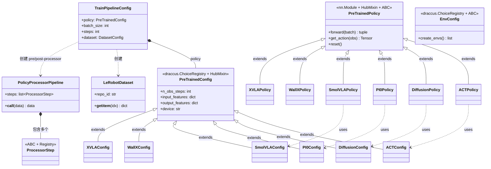
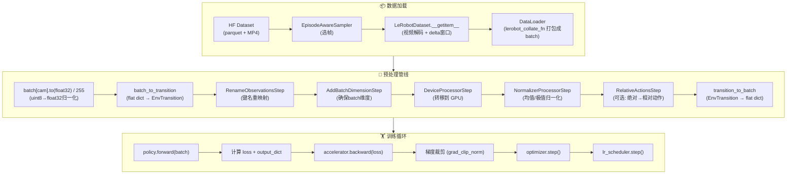
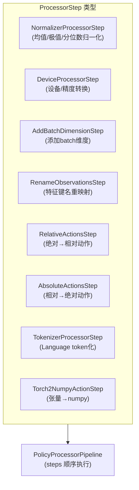

# LeRobot 模块结构与数据训练流程

## 一、核心模块概览

```
src/lerobot/
├── scripts/          # CLI 入口（lerobot-train, eval, record, replay 等）
├── configs/          # draccus 配置类（TrainPipelineConfig, PreTrainedConfig）
├── policies/         # 策略实现（ACT, Diffusion, PI0, SmolVLA 等 14 种）
├── processor/        # 数据处理器步骤（归一化、设备转移、重命名等）
├── datasets/         # 数据集（LeRobotDataset, StreamingLeRobotDataset）
├── envs/             # 环境（PushT, Aloha, LIBERO 等）
├── robots/           # 机器人硬件抽象层（SO-101, Koch, Aloha 等）
├── motors/           # 电机控制（Feetech, Dynamixel, Damiao 等）
├── cameras/          # 相机驱动（OpenCV, Intel RealSense）
├── teleoperators/    # 遥操作设备（手柄、手机、同构机器人）
├── rollout/          # 策略推理引擎（同步/异步、环缓冲区）
├── rl/               # 强化学习算法（SAC）
├── rewards/          # 奖励函数
├── model/            # 模型组件
├── optim/            # 优化器与学习率调度器
├── transforms/       # 图像增强（随机裁剪、颜色抖动等）
├── transport/        # 网络传输（gRPC 远程控制）
├── async_inference/  # 异步推理
├── common/           # 通用工具（wandb、checkpoint 等）
├── utils/            # 工具函数（constants, collate, device 等）
└── types.py          # 核心类型定义（EnvTransition, PolicyAction 等）
```

### 支持的策略（14 种）

| 注册名 | 类名 | 架构 | 语言 |
|-------|------|------|------|
| `act` | ACTPolicy | Transformer + VAE | ❌ |
| `diffusion` | DiffusionPolicy | CNN U-Net 扩散 | ❌ |
| `tdmpc` | TDMPCPolicy | 世界模型 + MPC | ❌ |
| `vqbet` | VQBeTPolicy | VQ-VAE + GPT | ❌ |
| `pi0` | PI0Policy | PaliGemma VLM + 流匹配 | ✅ |
| `pi05` | PI05Policy | PI0 改进版 | ✅ |
| `pi0_fast` | PI0FastPolicy | PaliGemma + 离散 token | ✅ |
| `smolvla` | SmolVLAPolicy | SmolVLM + 流匹配 | ✅ |
| `wall_x` | WallXPolicy | Qwen2.5-VL + ODE 流匹配 | ✅ |
| `xvla` | XVLAPolicy | Florence-2 + Transformer | ✅ |
| `multi_task_dit` | MultiTaskDiTPolicy | CLIP + DiT 扩散/流匹配 | ✅ |
| `gaussian_actor` | GaussianActorPolicy | MLP 高斯分布 (SAC 使用) | ❌ |
| `groot` | GrootPolicy | NVIDIA GR00T 包装器 | ✅ |
| `eo1` | EO1Policy | Qwen2.5-VL + 流匹配 | ✅ |

---

## 二、核心类关系图



---

## 三、训练数据流

### 数据加载 → 预处理 → 策略前向 → 损失 → 优化



### 推理/评估回传流

```mermaid
flowchart LR
    subgraph EvalIn["输入"]
        D1["Robot/Gym Observation"]
    end
    subgraph EvalPre["预处理 (同训练)"]
        D2["batch_to_transition →\n归一化 → 设备转移"]
    end
    subgraph Inference["策略推理"]
        D3["policy.select_action(obs)\n→ 动作张量"]
    end
    subgraph EvalPost["后处理管线"]
        D4["policy_action_to_transition\n(张量 → EnvTransition)"]
        D5["UnnormalizerProcessorStep\n(反归一化)"]
        D6["AbsoluteActionsStep\n(相对→绝对动作)"]
        D7["DeviceProcessorStep\n(→ CPU)"]
        D8["Torch2NumpyActionStep\n(可选: 张量→numpy)"]
        D9["transition_to_policy_action\n(EnvTransition → 张量/numpy)"]
    end
    subgraph EvalOut["输出"]
        E1["env.step(action)\n或 robot.send_action(action)"]
    end

    EvalIn --> EvalPre --> Inference --> EvalPost --> EvalOut
```



---

## 四、数据转换流程详解

### 数据类型演变

| 阶段 | 数据类型 | 说明 |
|------|---------|------|
| 源文件 | parquet + MP4 | HF Dataset 文件格式 |
| `__getitem__` | `dict[str, Tensor]` | 单帧，uint8 图像，原始 state/action |
| DataLoader 输出 | `dict[str, Tensor]` | batch 化：(B, C, H, W) 等 |
| float32 转换后 | `dict[str, Tensor]` | 图像转 float32/255 |
| Preprocessor 输入 | `flat dict` | `{"observation.state": ..., "observation.images.cam": ..., "action": ...}` |
| `batch_to_transition` | `EnvTransition` | 结构化：`{observation: dict, action: Tensor, ...}` |
| 各 ProcessorStep | `EnvTransition` | 逐步变换（重命名、归一化、设备转移） |
| `transition_to_batch` | `flat dict` | 恢复展平格式 |
| **policy.forward** | `flat dict` | **归一化后的 GPU tensor batch** |
| policy 输出 | `PolicyAction = Tensor` | 归一化的动作张量 |
| Postprocessor 输入 | `EnvTransition` | 通过 `policy_action_to_transition` |
| Postprocessor 输出 | `EnvAction/PolicyAction` | 反归一化的原始动作 |

### 核心类型定义（`src/lerobot/types.py`）

```
PolicyAction   = torch.Tensor          # 策略输出的动作
EnvAction      = np.ndarray            # Gym 环境接收的动作
RobotAction    = dict[str, Any]        # 机器人硬件消费的动作
EnvTransition  = TypedDict {           # 数据传递的核心容器
    observation: dict,
    action: Tensor,
    reward: Tensor,
    done: bool,
    truncated: bool,
    info: dict,
    complementary_data: dict,
}
```

### 关键预处理步骤



### 各策略预处理管线差异

| 策略 | 预处理器 (输入 → 模型) | 后处理器 (模型 → 动作) |
|------|----------------------|----------------------|
| **ACT** | 重命名 → batch维度 → GPU → 归一化 | 反归一化 → CPU |
| **Diffusion** | 同上 | 同上 |
| **PI0** | 重命名 → batch维度 → GPU → 归一化 → tokenizer | 反归一化 → CPU |
| **SmolVLA** | 重命名 → batch维度 → GPU → 归一化 → 添加换行符 | 反归一化 → CPU |
| **GaussianActor** | 重命名 → batch维度 → GPU → 归一化 | 反归一化 → CPU |
| **TDMPC** | 重命名 → batch维度 → GPU (无归一化) | 无 |
| **Groot** | 重命名 → batch维度 → GPU → 归一化 → pack | unpack → 反归一化 → CPU |

> 注：训练时只执行预处理器；推理时先执行预处理器，再执行后处理器。
