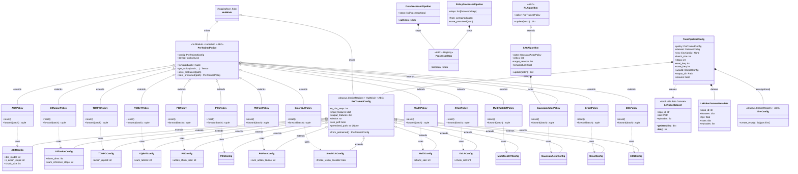

# LeRobot 核心类图

```mermaid
classDiagram
    class HubMixin {
        <<huggingface_hub>>
    }

    class PreTrainedConfig {
        <<draccus.ChoiceRegistry + HubMixin + ABC>>
        +n_obs_steps: int
        +input_features: dict
        +output_features: dict
        +device: str
        +use_peft: bool
        +pretrained_path: str | None
        +from_pretrained() PreTrainedConfig
    }

    class ACTConfig {
        +dim_model: int
        +n_action_steps: int
        +chunk_size: int
    }

    class DiffusionConfig {
        +down_dims: list
        +num_inference_steps: int
    }

    class TDMPCConfig {
        +action_repeat: int
    }

    class VQBeTConfig {
        +num_latents: int
    }

    class PI0Config {
        +action_chunk_size: int
    }

    class PI05Config {
    }

    class PI0FastConfig {
        +num_action_tokens: int
    }

    class SmolVLAConfig {
        +freeze_vision_encoder: bool
    }

    class WallXConfig {
        +chunk_size: int
    }

    class XVLAConfig {
        +chunk_size: int
    }

    class MultiTaskDiTConfig {
    }

    class GaussianActorConfig {
    }

    class GrootConfig {
    }

    class EO1Config {
    }

    class PreTrainedPolicy {
        <<nn.Module + HubMixin + ABC>>
        +config: PreTrainedConfig
        +device: torch.device
        +forward(batch) tuple
        +get_action(batch, ...) Tensor
        +save_pretrained(path)
        +from_pretrained(path) PreTrainedPolicy
    }

    class ACTPolicy {
        +reset()
        +forward(batch) tuple
    }

    class DiffusionPolicy {
        +reset()
        +forward(batch) tuple
    }

    class TDMPCPolicy {
        +reset()
        +forward(batch) tuple
    }

    class VQBeTPolicy {
        +reset()
        +forward(batch) tuple
    }

    class PI0Policy {
        +reset()
        +forward(batch) tuple
    }

    class PI05Policy {
        +reset()
        +forward(batch) tuple
    }

    class PI0FastPolicy {
        +reset()
        +forward(batch) tuple
    }

    class SmolVLAPolicy {
        +reset()
        +forward(batch) tuple
    }

    class WallXPolicy {
        +reset()
        +forward(batch) tuple
    }

    class XVLAPolicy {
        +reset()
        +forward(batch) tuple
    }

    class MultiTaskDiTPolicy {
        +reset()
        +forward(batch) tuple
    }

    class GaussianActorPolicy {
        +reset()
        +forward(batch) tuple
    }

    class GrootPolicy {
        +reset()
        +forward(batch) tuple
    }

    class EO1Policy {
        +reset()
        +forward(batch) tuple
    }

    class LeRobotDataset {
        <<torch.utils.data.Dataset>>
        +repo_id: str
        +root: Path
        +episodes: list
        +__getitem__(idx) dict
        +__len__() int
    }

    class LeRobotDatasetMetadata {
        +repo_id: str
        +features: dict
        +fps: float
        +stats: dict
        +episodes: list
    }

    class TrainPipelineConfig {
        +policy: PreTrainedConfig
        +dataset: DatasetConfig
        +env: EnvConfig | None
        +batch_size: int
        +steps: int
        +eval_freq: int
        +save_freq: int
        +wandb: WandBConfig
        +output_dir: Path
        +resume: bool
    }

    class EnvConfig {
        <<draccus.ChoiceRegistry + ABC>>
        +create_envs() list[gym.Env]
    }

    class DataProcessorPipeline {
        +steps: list[ProcessorStep]
        +__call__(data) data
    }

    class PolicyProcessorPipeline {
        +steps: list[ProcessorStep]
        +from_pretrained(path)
        +save_pretrained(path)
    }

    class ProcessorStep {
        <<ABC + Registry>>
        +call(data) data
    }

    class SACAlgorithm {
        +actor: GaussianActorPolicy
        +critics: list
        +target_network: list
        +temperature: float
        +update(batch) dict
    }

    class RLAlgorithm {
        <<ABC>>
        +policy: PreTrainedPolicy
        +update(batch) dict
    }

    PreTrainedConfig <|-- ACTConfig : extends
    PreTrainedConfig <|-- DiffusionConfig : extends
    PreTrainedConfig <|-- TDMPCConfig : extends
    PreTrainedConfig <|-- VQBeTConfig : extends
    PreTrainedConfig <|-- PI0Config : extends
    PreTrainedConfig <|-- PI05Config : extends
    PreTrainedConfig <|-- PI0FastConfig : extends
    PreTrainedConfig <|-- SmolVLAConfig : extends
    PreTrainedConfig <|-- WallXConfig : extends
    PreTrainedConfig <|-- XVLAConfig : extends
    PreTrainedConfig <|-- MultiTaskDiTConfig : extends
    PreTrainedConfig <|-- GaussianActorConfig : extends
    PreTrainedConfig <|-- GrootConfig : extends
    PreTrainedConfig <|-- EO1Config : extends

    PreTrainedPolicy <|-- ACTPolicy : extends
    PreTrainedPolicy <|-- DiffusionPolicy : extends
    PreTrainedPolicy <|-- TDMPCPolicy : extends
    PreTrainedPolicy <|-- VQBeTPolicy : extends
    PreTrainedPolicy <|-- PI0Policy : extends
    PreTrainedPolicy <|-- PI05Policy : extends
    PreTrainedPolicy <|-- PI0FastPolicy : extends
    PreTrainedPolicy <|-- SmolVLAPolicy : extends
    PreTrainedPolicy <|-- WallXPolicy : extends
    PreTrainedPolicy <|-- XVLAPolicy : extends
    PreTrainedPolicy <|-- MultiTaskDiTPolicy : extends
    PreTrainedPolicy <|-- GaussianActorPolicy : extends
    PreTrainedPolicy <|-- GrootPolicy : extends
    PreTrainedPolicy <|-- EO1Policy : extends

    ACTPolicy ..> ACTConfig : uses
    DiffusionPolicy ..> DiffusionConfig : uses
    TDMPCPolicy ..> TDMPCConfig : uses
    VQBeTPolicy ..> VQBeTConfig : uses
    PI0Policy ..> PI0Config : uses
    PI05Policy ..> PI05Config : uses
    PI0FastPolicy ..> PI0FastConfig : uses
    SmolVLAPolicy ..> SmolVLAConfig : uses
    WallXPolicy ..> WallXConfig : uses
    XVLAPolicy ..> XVLAConfig : uses
    MultiTaskDiTPolicy ..> MultiTaskDiTConfig : uses
    GaussianActorPolicy ..> GaussianActorConfig : uses
    GrootPolicy ..> GrootConfig : uses
    EO1Policy ..> EO1Config : uses

    TrainPipelineConfig *-- PreTrainedConfig : policy
    TrainPipelineConfig *-- EnvConfig : env (optional)
    TrainPipelineConfig *-- LeRobotDatasetMetadata : dataset
    TrainPipelineConfig ..> LeRobotDataset : creates

    PolicyProcessorPipeline *-- ProcessorStep : steps
    DataProcessorPipeline *-- ProcessorStep : steps

    RLAlgorithm <|-- SACAlgorithm : extends
    SACAlgorithm *-- GaussianActorPolicy : actor

    HubMixin <|-- PreTrainedConfig : mixes
    HubMixin <|-- PreTrainedPolicy : mixes
```
